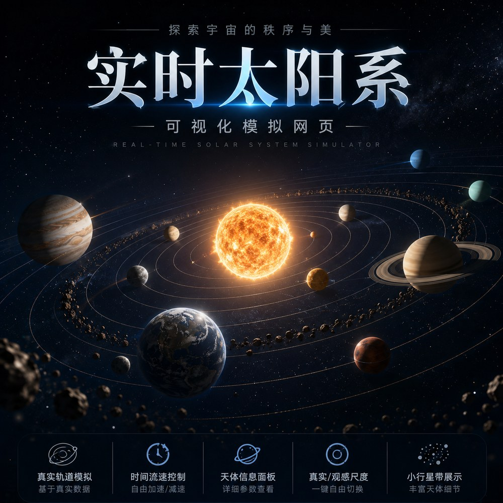
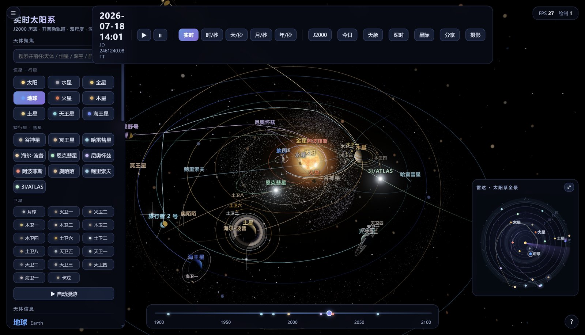
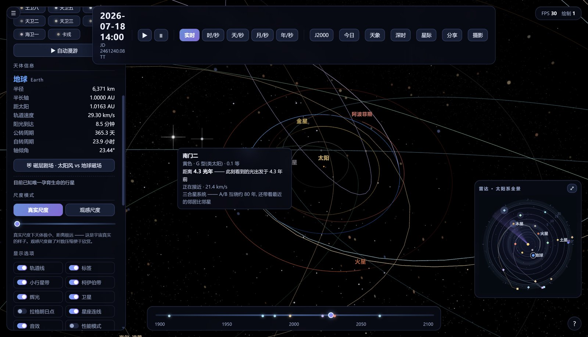
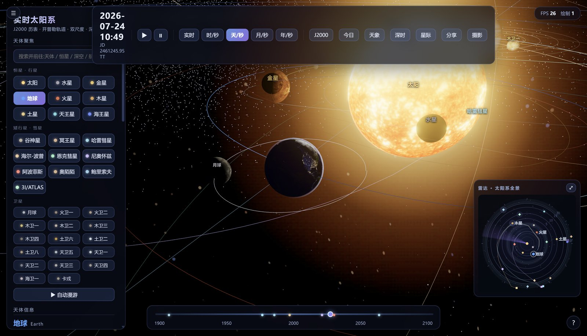
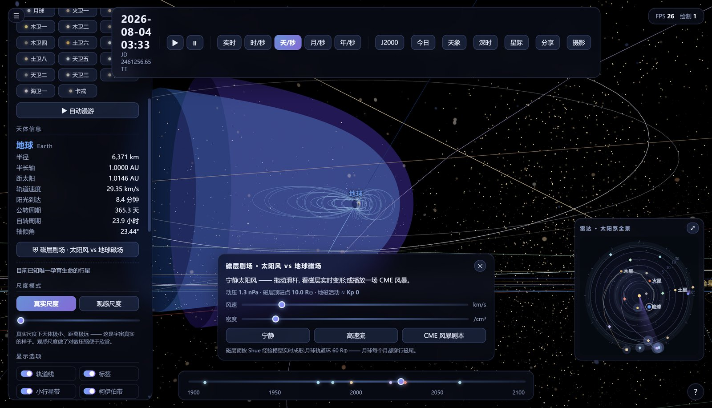
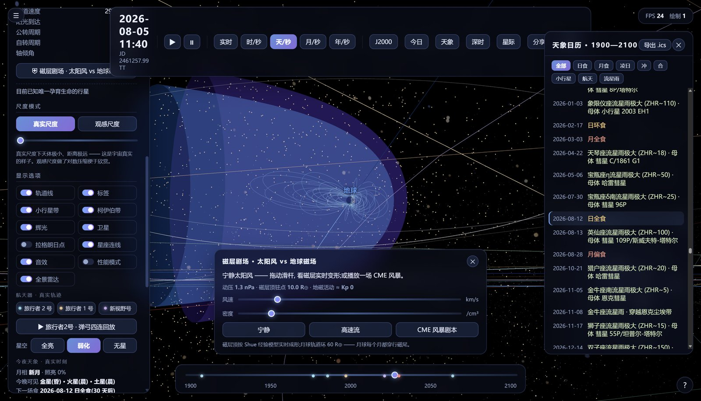
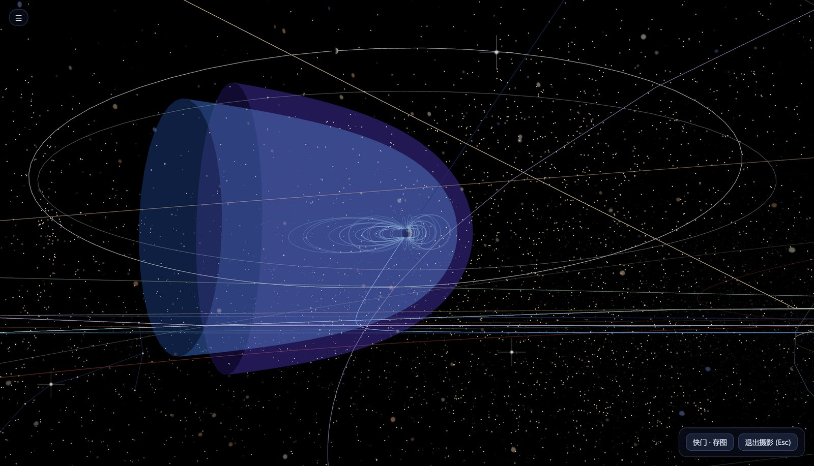
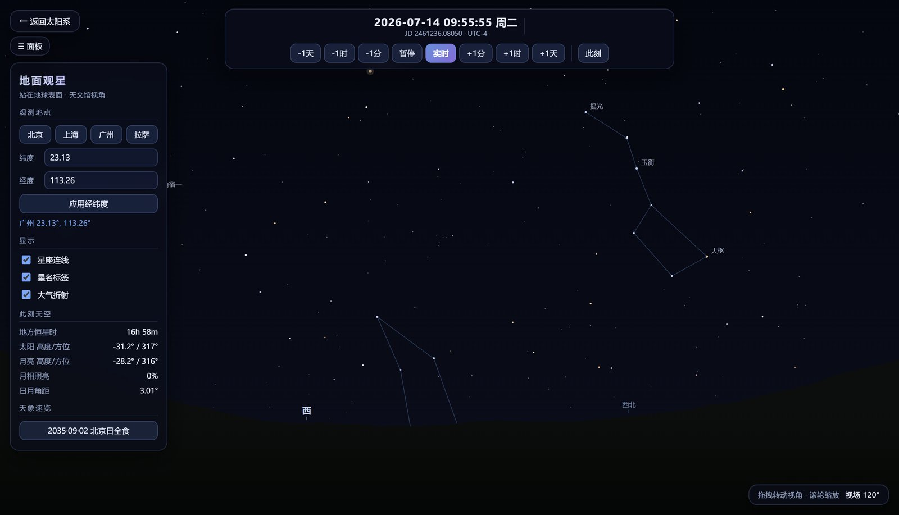
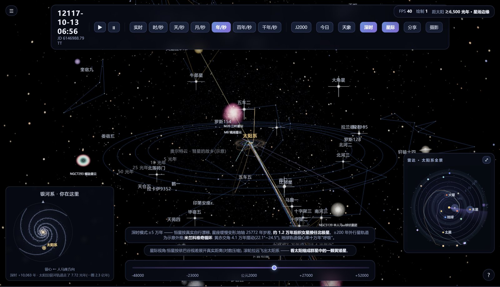

<p align="center">
  <a href="README.md">简体中文</a> · <b>English</b>
</p>

<p align="center">
  
</p>

# Real-Time Solar System

A real-time solar system that runs in the browser. Ephemeris-driven planetary orbits, lunar rover driving, ground-based stargazing, and a rocket launch site.

Pure front-end: zero dependencies, zero build step, zero backend. All assets are embedded, so it works fully offline — just open the file.

Live demo: https://zunyiqingfeng-code.github.io/realtime-solar-system/

## Four pages

| Page | What it shows |
| --- | --- |
| `index.html` | Main solar system view: planet and moon orbits, comets, the asteroid belt, deep-sky objects, spacecraft trajectories, and astronomical events |
| `moon.html` | Lunar rover: drive across a landing site rebuilt from real lunar terrain data |
| `sky.html` | Ground stargazing: the sky from any location on Earth, at any moment |
| `launch_site.html` | Rocket launch site: a single-file GLB scene preview |

## Preview

<table>
  <tr>
    <td width="50%"><br><sub><b>System overview</b> · Keplerian orbits driven by the J2000 ephemeris — planets, moons, comets, asteroid belt and spacecraft in one frame</sub></td>
    <td width="50%"><br><sub><b>Nearby stars</b> · Hover for light-travel time and true distance, e.g. Alpha Centauri: "the light you see now left 4.3 years ago"</sub></td>
  </tr>
  <tr>
    <td><br><sub><b>Scale modes</b> · Sun, Earth, Moon, Mercury and Venus in one close-up — toggle between true scale and viewing scale</sub></td>
    <td><br><sub><b>Magnetosphere theater</b> · Solar wind vs. Earth's magnetic field, shaped in real time by the Shue model, with a playable CME storm</sub></td>
  </tr>
  <tr>
    <td><br><sub><b>Astro calendar</b> · Eclipses, meteor showers, conjunctions and oppositions from 1900–2100, exportable as .ics</sub></td>
    <td><br><sub><b>Photography mode</b> · A clean, UI-free frame — shutter to save the shot</sub></td>
  </tr>
  <tr>
    <td><br><sub><b>Ground stargazing</b> · A planetarium view from any latitude/longitude and time, with constellation lines and atmospheric refraction</sub></td>
    <td><br><sub><b>Deep time · Interstellar</b> · Stars drift by their real proper motion; zoom out to watch the Sun shrink into one yellow dwarf among many</sub></td>
  </tr>
</table>

## Running it

Just open `index.html`. Everything works under the `file://` protocol — there are no cross-origin resource loads.

To try the PWA (offline cache + install as a desktop/mobile app), start a local server:

```bash
python3 -m http.server 8000
# open http://localhost:8000
```

The Service Worker only registers under `http(s)` and `localhost` — browsers do not allow SW registration on `file://` pages for security reasons. This is not a bug; page functionality is unaffected.

## Deployment

Any static host works: upload the repository contents to the site root.

GitHub Pages: Settings → Pages → Source → Deploy from a branch, branch `main`, folder `/ (root)`.

On your own server, enable gzip (js/html/json) to cut first-visit transfer from ~41MB to ~12MB; set HTML to `no-cache` and js/png to `max-age=86400`. HTTPS is required, otherwise the Service Worker and PWA install will not work.

## Updating the cache

The Service Worker pre-caches all 25 assets and serves cache-first with silent background updates. After changing any asset, bump the version number at the top of `sw.js`:

```js
const VER = "v27-1";   // change to v27-2, v27-3, ...
```

Otherwise visitors keep getting the old cache. The new SW clears the previous cache on activation, and a single refresh brings the new version.

## Data sources

- Planet, comet and asteroid orbital elements: JPL HORIZONS and JPL SBDB
- All-sky map: NASA SVS Tycho Sky Map
- Lunar terrain and textures: LRO
- 3D rendering: three.js (MIT)

## License

The code is MIT-licensed, see [LICENSE](LICENSE).

The embedded textures are not covered by MIT and retain their original licenses (NASA public domain / CC BY 4.0 / third-party assets requiring attribution). See [ATTRIBUTION.md](ATTRIBUTION.md). When using this project, please also comply with the original terms of those assets.
